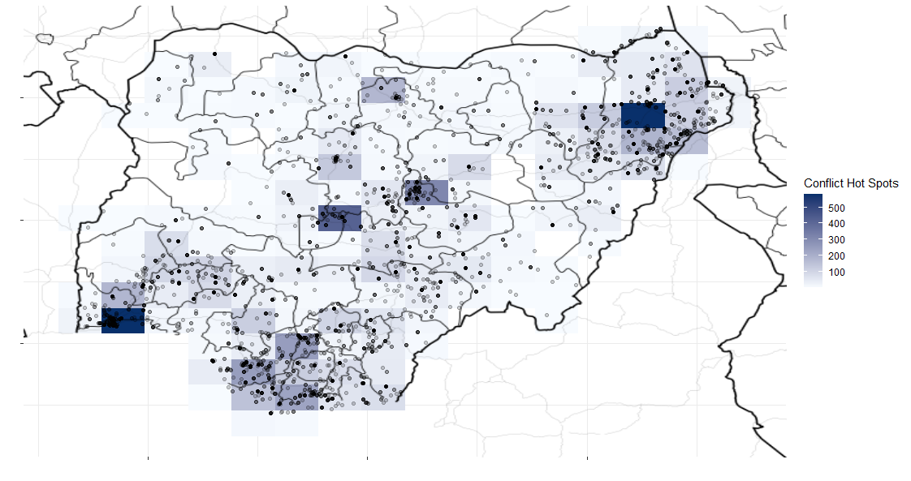

```{r setup, include=FALSE}
knitr::opts_chunk$set(echo = TRUE, warning=FALSE)

shhLoad=function(x){
  if( !x %in% installed.packages()[,1] ){
    install.packages(x, repos='https://cloud.r-project.org') }
  suppressMessages(
    suppressWarnings(
      library(x, character.only = TRUE))) }

pkgs=c(
  'dplyr', 'ggplot2', 'tidyr', 
  'tidyverse', 'cshapes', 'ggmap',
  'rgeos', 'maptools',
  'broom', 'countrycode'
  )

for(pkg in pkgs){  shhLoad(pkg) }
```

## Introduction to spatial data and maps! 

Today we just want to get all of this code working on your machine. Please NOTE I WILL GO INTO MORE DETAIL ON THURSDAY! Today is a high-level introduction and again, we just want to also make sure everyone can run this code as well as access the google API.

Before we begin the code below, make sure you have installed and libraried all of the above packages successfully.

## Case of Nigeria

Let's build something like this! 

```{r, echo=FALSE, eval=TRUE, out.width='80%'}

```

We are using information from two datasets in the plot above. First is battle events data from ACLED, which is stored in the `nData` object that we bring into our workspace from the `acled_nigeria.rda` file

```{r}
# following load call loads an object into the workspace
# named nData
load('acled_nigeria.rda')
head(nData)
nData[1:2,]
```

## nData

What is in this data?

- YEAR: time period of conflict (2001-2016)
- a1: sender/initiator of conflict
- a2: receiver/target of conflict
- LATITUDE/LONGITUDE: geographic location of conflict
- read all about the data here: https://acleddata.com/

## top 10 initiators

We can easily look at the armed actors that initiated conflict the most.

```{r}
sort(table(nData$a1), decreasing=TRUE)[1:10]
```

## top 10 receivers

As well as those who were on the receiving end the most.

```{r}
sort(table(nData$a2), decreasing=TRUE)[1:10]
```

## Where does conflict occur?

First we will use cshapes and base R. 

What is a shape file?

- The shapefile format is a geospatial vector data format for geographic information system (GIS) software
- The shapefile format stores the data as primitive geometric shapes like points, lines, and polygons. 
- These shapes, together with data attributes that are linked to each shape, create the representation of the geographic data. 
- The term "shapefile" is quite common, but the format consists of a collection of files with a common filename prefix, stored in the same directory. The three mandatory files have filename extensions .shp, .shx, and .dbf.

```{r}
# example from cshp package
worldMap = cshp(
  date=as.Date('2016-1-1')
  )

head(worldMap@data)

# what is nigeria called in the sp df
sort(unique(worldMap@data$CNTRY_NAME))

# filter this dataset by cntry name = nigeria
cntryShape = worldMap[worldMap$CNTRY_NAME == 'Nigeria', ]

# now we can go ahead and plot it just with base R
plot(cntryShape)
```

You could build on the base R approach above. In general, this can be a nice to check out shape files when you are exploring them. Now that we have done that, let's move to ggplot. Let's read from `?ggmap.`

A couple of points here: geom_map understands the following aesthetics (required aesthetics are in bold):

- *map_id*
- alpha
- colour
- fill
- linetype
- size

```{r}
# need this to get clips from google maps
install.packages("gpclib", type="source", repos='https://cloud.r-project.org')

# do not worry too much about what a 'cow code is' these are used as numeric indicators for countries
nigeriaShape = broom::tidy(cntryShape, region='COWCODE')
nData$id = 475

# very simple ggplot usage with just points 
ggplot(nData, aes(x=LONGITUDE, y=LATITUDE)) + geom_point()

# ggplot with map shape
ggplot(nData, aes(map_id = id, x=LONGITUDE, y=LATITUDE)) + 
  geom_map(map=nigeriaShape, fill='white') +  
  geom_point()
```

What this should tell you is the first piece of information you need to make a spatial visualization are "events" that actually have a representation in some geographic system of measurement.

In the case of the `nData` object we have information on conflictual events that occurred in Nigeria by latitude and longitude.

You could play with just these basics to get decent maps!

## What about maps with more information? 

You can all go and register with:  https://cloud.google.com/maps-platform/

- maps static API
- geocoding API
- Roads API
- geolocation API

get api key and then pass this into r via register_google function

# GO get your own API before doing the code below! SEE SLIDES

```{r}
register_google('YOUR API')

ngaLines = ggmap::get_map(
  location='Nigeria', 
  zoom=6,
  maptype='toner-lines' )
ggmap(ngaLines)

nashMap = ggmap::get_map(
  location='Nashville',
  maptype='roadmap', zoom=15
)
ggmap(nashMap)

# check this error out
whiteHouse = ggmap::get_map(
  location='White House',
  maptype='roadmap', zoom=20
)
ggmap(whiteHouse)

theBigHouse = ggmap::get_map(
  location='Michigan Football Stadium', 
  maptype='roadmap', zoom=17)
ggmap(theBigHouse)

```

## closer to goal

so now we can combine nData with google maps version of nigeria

```{r}
ggmap(ngaLines) +
  geom_point(data=nData, aes(x=LONGITUDE, y=LATITUDE),
    alpha=.3, 
    color='red'
  )
```

## On Thursday

We will delve deeper into the components of the mapping process. We will talk about the difference between loading in a spatial polygon dataframe via the `cshapes` package and using the `ggmap` package with google maps. We will go into more detail on what parameters are for these different arguments and objects.

## HELPFUL REFERENCES

- https://ropensci.github.io/plotly/ggplot2/geom_map.html